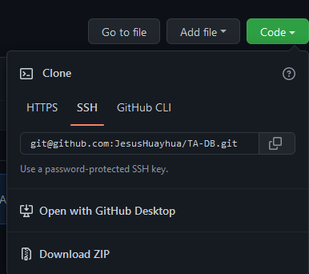
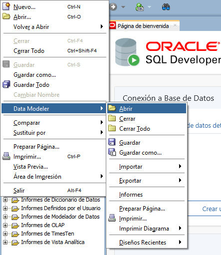
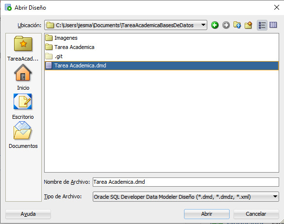
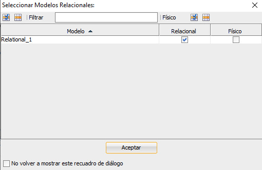
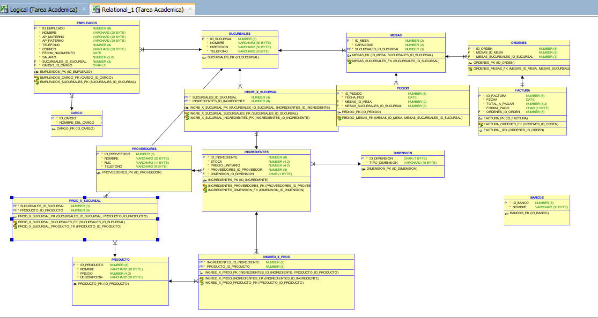
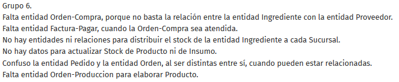
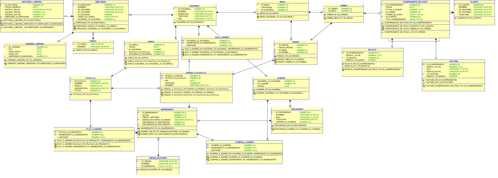

 <h1>  Tarea Academica  </h1> 

- [Pasos para abrir el Modelo Relacional:](#pasos-para-abrir-el-modelo-relacional)
  - [1) Descargar el Modelo relacional](#1-descargar-el-modelo-relacional)
  - [2) Abrir el Modelo Relacional](#2-abrir-el-modelo-relacional)
    - [Paso 1](#paso-1)
    - [Paso 2](#paso-2)
- [Primer Modelo Relacional del proyecto](#primer-modelo-relacional-del-proyecto)
- [Segundo Modelo Relacional del proyecto](#segundo-modelo-relacional-del-proyecto)

# Pasos para abrir el Modelo Relacional:

Estos son los pasos previso para poder descargar, y visualizar el modelo relacional en el Oracle SQL Developer

## 1) Descargar el Modelo relacional

Para poder descargar el modelo relacional, así como el contendio extra de la base de datos:

- Podemos descargar el zip y posteriormente descomprimirlo.
- Podemos clonar el repositorio(si tienen, git instalado es su computador)

Para poder clonar el repositorio, se utiliza el comando `git clone`, seguido del enlace ssh que parace en la image.
Recomiendo esta última forma, porque para futuros cambios, no va a tener que estar descargando a cada rato los zips, sino
solo con el comando `git pull`, poder bajar los cambios realizados.

## 2) Abrir el Modelo Relacional

### Paso 1

Abrirmos el Oracle SQL, y nos dirigimos a la dirección que aparece en la imagen:

### Paso 2

Buscamos la dirección donde descargamos el contenido del repositorio, aceptamos
y nos debería salir la siguiente página.

# Primer Modelo Relacional del proyecto

Presenta erroes y correciones, de las.

# Segundo Modelo Relacional del proyecto

